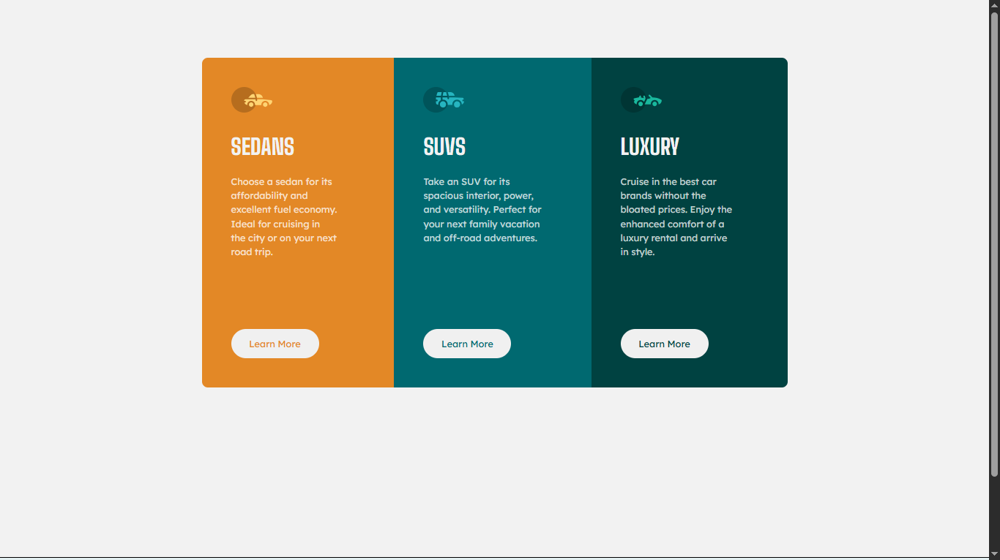

# 🚗 3-Column Preview Card Component

  

A responsive three-column card component built with HTML and CSS as part of a Frontend Mentor challenge.

## 📖 About the Challenge

This project focuses on creating a clean, responsive multi-column layout while maintaining consistent spacing and alignment across different screen sizes.

## ✨ Highlights

- 📱 Responsive layout for mobile and desktop.
- 🧱 Built with semantic HTML.
- 🎨 Modern styling using Flexbox.
- 🖱️ Interactive hover and active button states.
- 📐 Consistent spacing and card alignment.

## 🛠️ Built With

  

## 💡 Key Takeaways

Throughout this project, I:

- Improved my understanding of Flexbox for vertical layouts.
- Learned how to align action buttons consistently using `margin-block-start: auto`.
- Practiced building equal-height cards without relying on fixed heights.
- Reinforced responsive design principles for different screen sizes.

## 🔗 Links

- 🌐 **Live Site:** https://frontend-mentor-3-column-preview-ca-nine.vercel.app/
- 💻 **Repository:** https://github.com/Ziad-mo205/Frontend-Mentor---3-column-preview-card.git
- 🎯 **Frontend Mentor Solution:** https://www.frontendmentor.io/solutions/responsive-3-column-card-using-media-query-1HWgr7uHVn